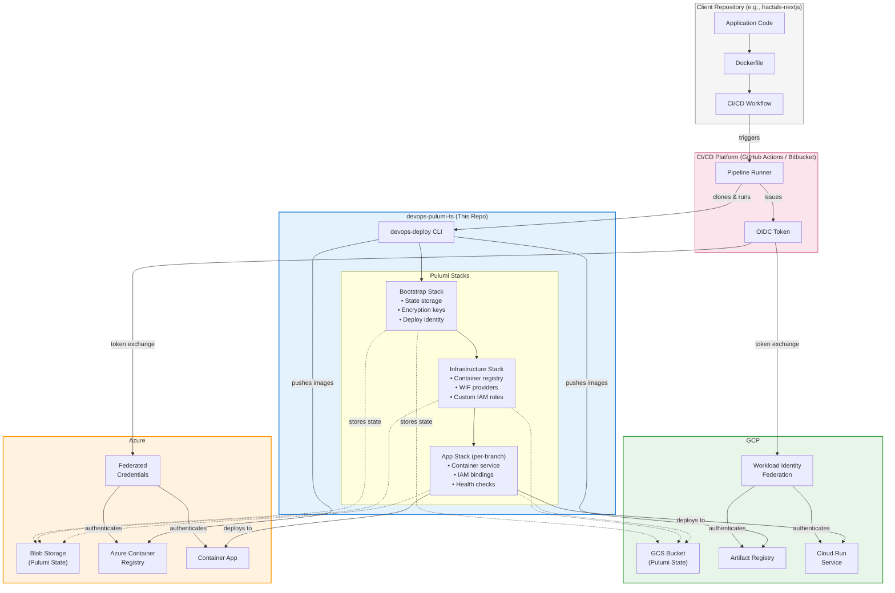
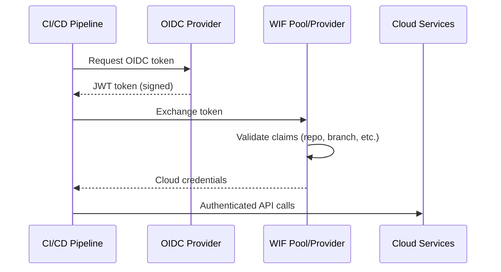
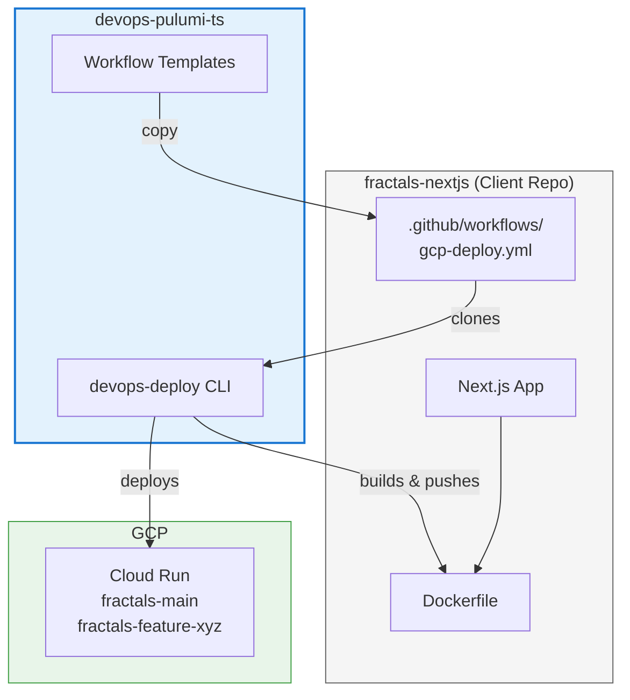
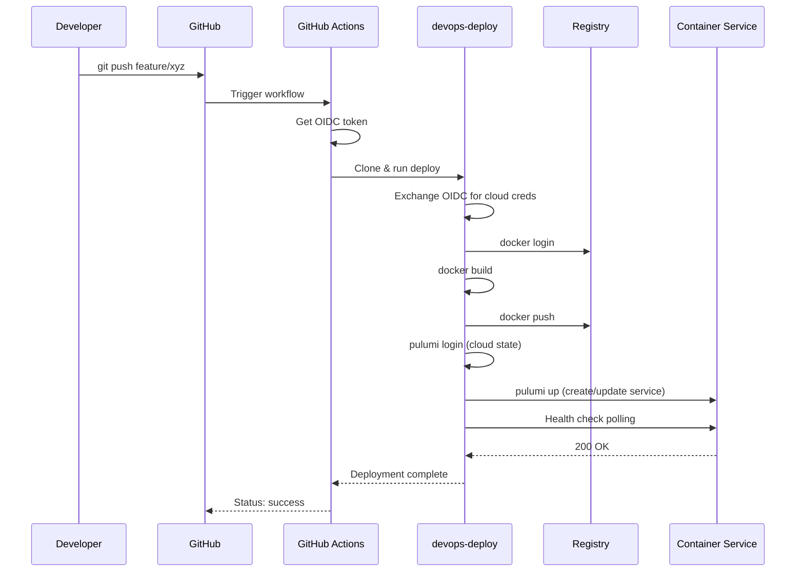
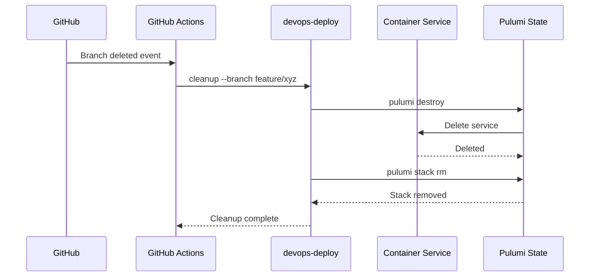

# DevOps Pulumi - Infrastructure Architecture

Unified Pulumi-based deployment platform for containerized applications to **GCP Cloud Run** or **Azure Container Apps** with keyless CI/CD authentication.



---

## Three-Tier Stack Architecture

Both GCP and Azure use an identical three-tier Pulumi stack hierarchy:

```mermaid
flowchart LR
    subgraph Tier1["Tier 1: Bootstrap"]
        B1["Local State"]
        B2["One-time setup"]
        B3["Creates cloud state storage"]
    end

    subgraph Tier2["Tier 2: Infrastructure"]
        I1["Cloud State"]
        I2["One-time setup"]
        I3["Shared resources"]
    end

    subgraph Tier3["Tier 3: App"]
        A1["Cloud State"]
        A2["Per-branch"]
        A3["Auto-cleanup"]
    end

    Tier1 -->|"outputs state URL"| Tier2
    Tier2 -->|"StackReference"| Tier3

    style Tier1 fill:#e8f5e9,stroke:#43a047
    style Tier2 fill:#e3f2fd,stroke:#1976d2
    style Tier3 fill:#fff3e0,stroke:#ff9800
```



| Tier | State | Frequency | GCP Resources | Azure Resources |
|------|-------|-----------|---------------|-----------------|
| **Bootstrap** | Local | Once per cloud | GCS bucket, KMS key, deploy SA | Storage account, blob container |
| **Infrastructure** | Cloud | Once per cloud | Artifact Registry, WIF Pool, custom roles | ACR, Container Apps Env, managed identity |
| **App** | Cloud | Per branch | Cloud Run service | Container App |

---

## Security Model

### Workload Identity Federation (Keyless Auth)



### Security Layers

| Layer | Protection |
|-------|------------|
| **Authentication** | OIDC token federation - no stored secrets in CI/CD |
| **Authorization** | Custom IAM/RBAC roles with minimum permissions |
| **Network** | Container services have configurable public/private access |
| **State** | Pulumi state encrypted at rest (KMS/managed keys) |
| **Secrets** | Passphrase-encrypted stack config, no plaintext secrets |

### Custom Roles (Minimum Privilege)

**GCP Custom IAM Roles:**

| Role | Permissions | Replaces |
|------|-------------|----------|
| `pulumiCloudRunDeploy` | Cloud Run CRUD, IAM policy management | `roles/run.admin` |
| `pulumiArtifactRegistry` | Image push/pull, tag management | `roles/artifactregistry.writer` |

**Azure Custom RBAC Roles:**

| Role | Permissions | Replaces |
|------|-------------|----------|
| `Container Apps Deployer` | Container Apps CRUD, revision management | `Contributor` (scoped) |
| `AcrPush` (built-in) | Registry push/pull | N/A |

### What the Deploy Identity **Can** Do
- Push Docker images to registry
- Create/update/delete container services
- Set IAM/RBAC for public access
- Read/write Pulumi state

### What the Deploy Identity **Cannot** Do
- Access databases, key vaults, secrets
- View project/subscription-level resources
- Manage IAM/RBAC at project/subscription level
- Access any resources outside container services

---

## How Client Projects Use This

### Integration Pattern



### Setup Steps for a New Project

1. **Copy workflow template** from `workflows/github/gcp-deploy.yml` to client repo
2. **Set repository secrets:**
   ```
   GCP_PROJECT, GCP_REGION, STATE_BUCKET, PULUMI_CONFIG_PASSPHRASE
   ```
3. **Set repository variables:**
   ```
   WIF_PROVIDER, SERVICE_ACCOUNT, APP_NAME
   ```
4. **Push code** - deployment happens automatically on every push

### Per-Branch Deployments

Each git branch gets an isolated deployment:

| Branch | GCP Service Name | Azure App Name |
|--------|-----------------|----------------|
| `main` | `myapp-main` | `myapp-main` |
| `feature/auth` | `myapp-feature-auth` | `myapp-feature-auth` |
| `bugfix/long-branch-name-xyz` | `myapp-bugfix-long-bra-a1b2c3` | `myapp-bugfix-lo-a1b2` |

Long branch names are truncated with a hash suffix to avoid collisions.

---

## Multi-Cloud Comparison

| Aspect | GCP | Azure |
|--------|-----|-------|
| **Container Service** | Cloud Run | Container Apps |
| **Container Registry** | Artifact Registry | ACR |
| **State Storage** | GCS bucket | Blob container |
| **Identity Model** | Service Account + WIF Pool | Managed Identity + Federated Creds |
| **Max Service Name** | 63 characters | 32 characters |
| **Default Memory** | 512Mi | 2Gi |
| **State Backend URL** | `gs://bucket-name` | `azblob://container?storage_account=name` |

### Switching Clouds

The CLI auto-detects the target cloud:

```bash
# Explicit
npx devops-deploy deploy --cloud gcp --app myapp --branch main

# Auto-detect via env vars
export GCP_PROJECT=my-project  # → deploys to GCP
export AZURE_SUBSCRIPTION_ID=xxx  # → deploys to Azure
npx devops-deploy deploy --app myapp --branch main
```

---

## Deployment Flow



---

## Cleanup Flow

When a branch is deleted:



---

## Directory Structure

```
devops-pulumi-ts/
├── gcp/
│   ├── bootstrap/          # GCS bucket, KMS, deploy SA
│   ├── infrastructure/     # Artifact Registry, WIF, roles
│   └── app/               # Cloud Run service
├── azure/
│   ├── bootstrap/          # Storage account
│   ├── infrastructure/     # ACR, Container Apps Env, WIF
│   └── app/               # Container App
├── cli/
│   └── src/
│       ├── index.ts        # Entry point, cloud detection
│       ├── commands/       # deploy.ts, cleanup.ts
│       └── lib/           # Docker, Pulumi, WIF utilities
├── workflows/
│   ├── github/            # GitHub Actions templates
│   └── bitbucket/         # Bitbucket Pipelines templates
└── docs/
    └── architecture.md    # This file
```

---

## Extending for New Projects

### Adding Azure Support to an Existing GCP Project

If `fractals-nextjs` currently deploys to GCP and you want Azure:

1. **Run Azure bootstrap once** (creates state storage):
   ```bash
   cd azure/bootstrap && pulumi up
   ```

2. **Run Azure infrastructure once** (creates ACR, Container Apps Env):
   ```bash
   cd azure/infrastructure && pulumi up
   ```

3. **Copy Azure workflow** to client repo:
   ```bash
   cp workflows/github/azure-deploy.yml fractals-nextjs/.github/workflows/
   ```

4. **Set Azure secrets** in GitHub repository settings

5. **Push** - Azure deployments now work alongside GCP

### Supported CI/CD Platforms

| Cloud | GitHub Actions | Bitbucket Pipelines |
|-------|---------------|---------------------|
| GCP | `gcp-deploy.yml` | `gcp-pipelines.yml` |
| Azure | `azure-deploy.yml` | `azure-pipelines.yml` |

---

## Key Benefits

- **Zero secrets in CI/CD** - OIDC federation means no stored credentials
- **Minimum privilege** - Custom roles prevent over-permissioning
- **Per-branch isolation** - Each branch gets its own service
- **Automatic cleanup** - Deleted branches remove their services
- **Multi-cloud ready** - Same patterns for GCP and Azure
- **Client-portable** - Clients can take ownership of their infrastructure
